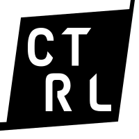

<center>



## Installation & Running
Make sure you have [python](https://www.python.org/) installed, if you don't then uh um yeah, get that installed!
<br>
Install the latest [vJoy](https://sourceforge.net/projects/vjoystick/) program and drivers (windows only I think, sorry)
<br>
Then download the latest version below
<br>
<br>
[](https://github.com/hiimpie/TwitchController/archive/refs/heads/main.zip)
<br>
> <b>WARNING! THIS CODE IS STILL WIP AND BROKEN lol</b><br>
> Things that don't work at all are Left and Right Triggers, DPad (Temp Fix), and sending messages back to chat.

Once you've downloaded python, vJoy and put this somewhere where you won't forget where it is, open up a powershell in your folder and run the code below!<br><br>
`
pip install -r requirements.txt
`
<br><br>
Then [grab yourself a twitch token](https://twitchapps.com/tmi/), create a .env file in the same folder as the rest of this jazz and write in `TWITCH_TOKEN=` and paste your token next to it (REMOVE `OAUTH:`)<br>
Then create another line and write `TWITCH_CHANNEL=` and put your channal next to it

## Using Template.py
I'd suggest you copy the template file and create a new so you've got a base to work off from everytime!<br>
To run the py file, click on run.bat! If that doesn't work, open up a powershell in the folder and run <br><br>
<b>`
python ./template.py
`</b>

## Functions you can currently do
It's currently limited because I have bugs but if you can fix these bugs I'll be happy
</center>

### Basic Twitch Command
```py
@cmd(bot, "cmdname")
def act(msg):
    print(msg)
```
> Explained...
<br>
`@cmd(bot, "cmdname")` - Creates the command, <b>`cmdname`</b> is what you send in chat for the action to happen.<br>
`def act(msg)` - Sets up the action to run.<br>
`print(msg)` - Outputs what caused the action to run which is `cmdname`.

### XBOX 360 Virtual Controller

> ## Buttons

<b>PressButton</b> - Presses and releases a button over a set amount of time
```py
@cmd(bot, "cmdname")
def act(msg):
    PressButton(BUTTON, TIME)
    print(msg)
```
> Explained...
<br>
`PressButton(BUTTON, TIME)` - It pressses `BUTTON` and releases it after `TIME` in seconds<br>
`BUTTON` - Buttons are found at the list below but examples are `XBOX_A` AND `XBOX_Y`<br>
`TIME` - Is a set amount of time in seconds, examples are `0.2` and `2`

<br>

<b>HoldButton</b> - Holds down a button
```py
@cmd(bot, "cmdname")
def act(msg): 
    HoldButton(BUTTON)
    print(msg)
```

> Explained...
<br>
`HoldButton(BUTTON)` - Holds down `BUTTON`<br>
`BUTTON` - Buttons are found at the list below but examples are `XBOX_A` AND `XBOX_Y`<br>

<br>

<b>ReleaseButton</b> - Releases a button
```py
@cmd(bot, "cmdname")
def act(msg): 
    ReleaseButton(BUTTON)
    print(msg)
```

> Explained...
<br>
`ReleaseButton(BUTTON)` - Releases `BUTTON`<br>
`BUTTON` - Buttons are found at the list below but examples are `XBOX_A` AND `XBOX_Y`<br>

<br>

> ## X Axis

<b>XAxis</b> - Moves the X Axis Joystick
```py
@cmd(bot, "cmdname")
def act(msg): 
    XAxis(DIRECTION)
    print(msg)
```

> Explained...
<br>
`XAxis(DIRECTION)` - Moves X Axis Joystick to `DIRECTION`<br>
`DIRECTIONS` - Directions are found at the list below but examples are `XBOX_AXISL` and `XBOX_AXISR`<br>

<br><br>

# List of XBOX Functions
These are all that work right now, all functions are subject to name change as this evolves<br>

### Xbox Buttons
Common Xbox Buttons
- `XBOX_A` - A Button (1)
- `XBOX_B` - B Button (2)
- `XBOX_X` - X Button (3)
- `XBOX_Y` - Y Button (4)
- `XBOX_LB` - Left Shoulder Button (5)
- `XBOX_RB` - Right Shoulder Button (6)

### Xbox DPad
Temp Fix, You'll need to set these up in steam controller setup for it to function
- `UPTEMP` - DPad Up (29, Temp)
- `DOWNTEMP` - DPad Down (30, Temp)
- `LEFTTEMP` - DPad Left (31, Temp)
- `RIGHTTEMP` - DPad Right (32, Temp)


### X Joystick
0x1 is the most left, 0x8000 is the most right
- `XBOX_AXISL` - Left (0x1)
- `XBOX_AXISML` - In-Between Left & Center (0x2000)
- `XBOX_AXISC` - Center (0x4000)
- `XBOX_AXISMR` - In-Between Right & Center (0x6000)
- `XBOX_AXISR` - Right (0x8000)

<center>

## FAQ
</center>

### Why did you go modular?
I went modular so then we could import other things like keyboard, or playstation or even virtual wiimote controller!

### Is it okay for me fork this/download it without your credit?
You can use this in videos without my credit, but all I do is if you change the code to where it's functionally better, please do a pull and I'll take a look!

### What inspired you to make this?
This was all started from me trying to figure out how can I let chat play garfield kart against me (it has a splitscreen mode but the second player must have a controller to use), so I went on hunting what best I could use and discovered pyvjoy and twitchio

### What is the current stack?
It isn't much but here's a list and what it does:
- pyvjoy + vjoy - vjoy is a virtual joystick that has a sdk which pyvjoy controls, allowing me to control that with easy python code!
- twitchio - reading twitch chat messages, I went for that route as it's easy to setup and use and I'm using to use more functionality later (send messages, channel points, extensions/pubsub stuff (idk how to make extensions still, someone teach me lol))
- I'm probably gonna use flask and some DB or something in the future for a localhost web gui to make it even easier to setup and run (like stream deck companion)

### What are the plans for the future?
The plans for the future is to add more virtual controllers, merge from vJoy and have our own virtual driver device<br>
Have a web gui using flask or whatever to make customizations easier with a template database for different games and modes!<br>
Display the command usage, what the controller is currently doing, countdown with a web browser source, tts, and more<br>
But that's for another day, for now I'll just conceptually come up with a figma design or two and see what the feedback is like!<br>
This is not a competitor, instead a tool that is open source as it should be with easy ways to modify<br>
Also it would be nice to have a stream deck and allow twitch channel points/bits/even extensions in the future!
